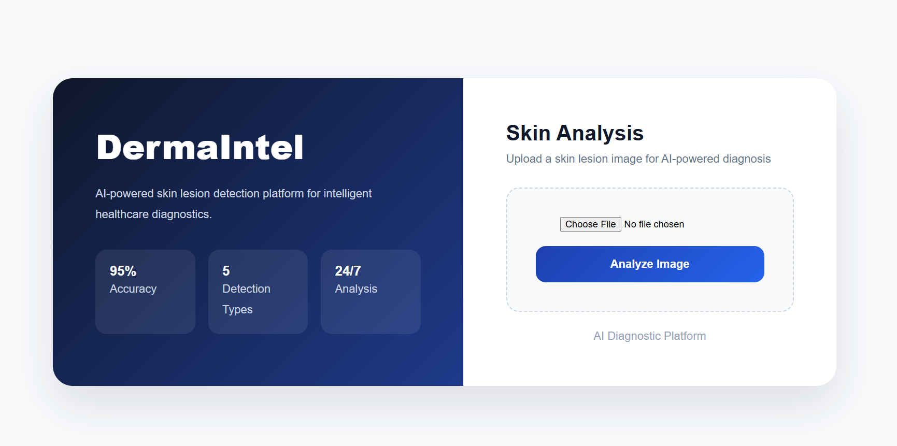
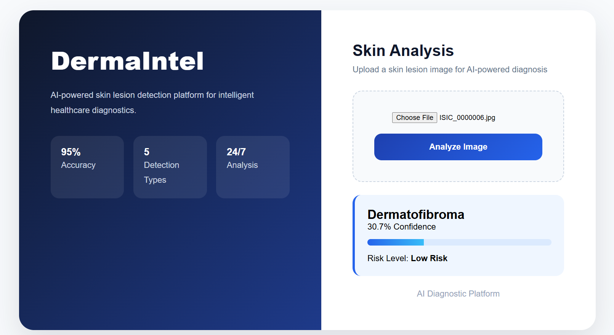

# React + Vite

This template provides a minimal setup to get React working in Vite with HMR and some ESLint rules.

Currently, two official plugins are available:

- [@vitejs/plugin-react](https://github.com/vitejs/vite-plugin-react/blob/main/packages/plugin-react) uses [Oxc](https://oxc.rs)
- [@vitejs/plugin-react-swc](https://github.com/vitejs/vite-plugin-react/blob/main/packages/plugin-react-swc) uses [SWC](https://swc.rs/)

## React Compiler

The React Compiler is not enabled on this template because of its impact on dev & build performances. To add it, see [this documentation](https://react.dev/learn/react-compiler/installation).

## Expanding the ESLint configuration

If you are developing a production application, we recommend using TypeScript with type-aware lint rules enabled. Check out the [TS template](https://github.com/vitejs/vite/tree/main/packages/create-vite/template-react-ts) for information on how to integrate TypeScript and [`typescript-eslint`](https://typescript-eslint.io) in your project.
# AI Skin Cancer Detection System

An enterprise-grade AI-powered web application for detecting and classifying skin cancer using deep learning and computer vision.

This system enables users to upload skin lesion images and receive intelligent predictions with confidence scores through a modern diagnostic interface.

---

## Overview

The AI Skin Cancer Detection System is a full-stack deep learning application designed to assist in preliminary skin lesion classification.

The platform integrates:

* **React.js Frontend**
* **FastAPI Backend**
* **TensorFlow Deep Learning Model**
* **Real-Time Prediction Engine**

The system classifies uploaded skin lesion images into multiple cancer categories with confidence analysis.

---

## Features

### Intelligent Image Classification

Detects and classifies skin lesions using a trained CNN model.

### Real-Time Prediction

Instant diagnosis generation after image upload.

### Confidence Analysis

Displays prediction confidence percentage.

### Responsive Corporate Dashboard

Professional enterprise-style interface optimized for desktop and mobile.

### FastAPI REST API

High-performance backend serving AI model predictions.

### Deep Learning Powered

Integrated TensorFlow model for accurate medical image classification.

---

## Tech Stack

### Frontend

* React.js
* CSS3
* Vite

### Backend

* FastAPI
* Python

### AI / Machine Learning

* TensorFlow
* Keras
* NumPy
* Pillow

---

## Skin Cancer Classes Detected

The system predicts among the following classes:

1. Basal Cell Carcinoma
2. Dermatofibroma
3. Melanoma
4. Nevus
5. Squamous Cell Carcinoma

---

## Project Structure

```bash
AI-Skin-Cancer-Detection/
│
├── frontend/
│   ├── App.jsx
│   ├── App.css
│   ├── index.css
│
├── backend/
│   ├── main.py
│   ├── skin_cancer_model.h5
│   ├── requirements.txt
│
└── README.md
```

---

## Installation

### Backend Setup

Install dependencies:

```bash
pip install -r requirements.txt
```

Run FastAPI server:

```bash
uvicorn main:app --reload
```

Backend runs at:

```bash
http://127.0.0.1:8000
```

---

### Frontend Setup

Install dependencies:

```bash
npm install
```

Run frontend:

```bash
npm run dev
```

Frontend runs at:

```bash
http://localhost:5173
```

---

## API Endpoint

### Prediction API

**POST**

```bash
/predict
```

Upload skin lesion image and receive:

```json
{
  "prediction": "Melanoma",
  "confidence": 96.45
}
```

---

## Applications

* Medical AI Research
* Skin Lesion Classification
* Academic Deep Learning Projects
* Computer Vision Healthcare Systems

---

## Future Enhancements

* Multi-image batch analysis
* Prediction history tracking
* PDF diagnostic reports
* Cloud deployment
* Advanced confidence visualization


## Project Screenshots

<p align="center">
  
</p>


<p align="center">
  
</p>
